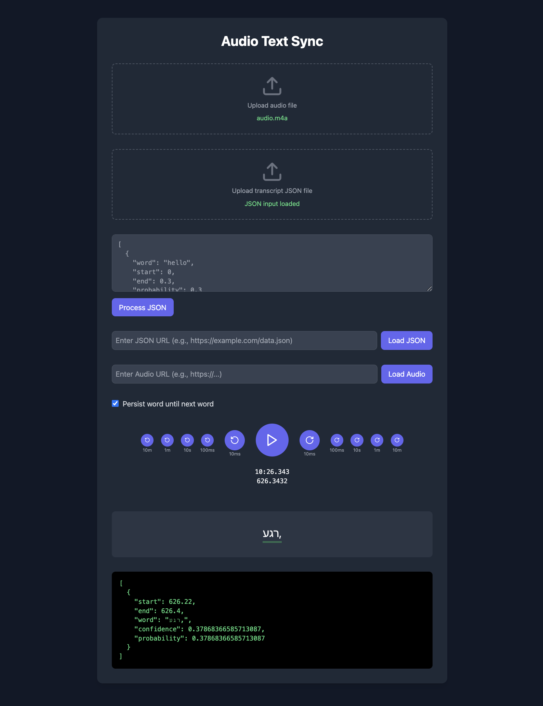

## Word Timing App

A simple application for displaying text with word-by-word timing.



### Installation

1. Clone the repository:
```bash
git clone https://github.com/yourusername/word-timing-app.git
cd word-timing-app
```

2. Install dependencies:
```bash
bun install
# or
npm install
```

3. Start the development server:
```bash
bun run dev
# or
npm run dev
```

4. Open your browser and navigate to `http://localhost:5174`

### Usage

1. Enter your text in the input field or upload a JSON file or load one from a URL
```json
[
  { "word": "hello", "start": 0.0, "end": 0.3, "probability": 0.3 },
  { "word": "world", "start": 0.32, "end": 1.0, "probability": 0.9 },
]
```
2. Upload an audio file or load one from a URL
3. Hit play


#### AI

Most of this was generated with AI so the code is kind of slop but it's accurate and functional.

#### License

This project is licensed under the MIT License
